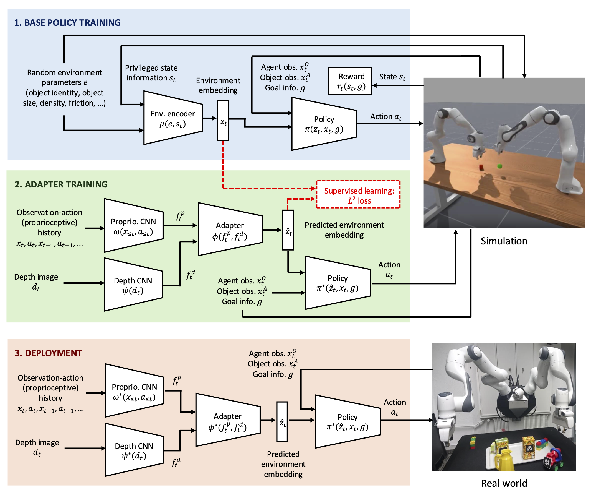

## Language-conditioned and generalisable bimanual robotic manipulation with RL, RMA, and VLMs

Generalisable robotic manipulation is a key challenge in robot learning. For robots to be successfully deployed to diverse real-life manipulation scenarios, they must adapt to various configurations of object mass, shape, friction coefficient, and external disturbance forces on the robot. At the same time, it is desired to imbue vision-language understanding into robot policies and make them language-conditioned. We take inspiration from [Rapid Motor Adaptation](https://arxiv.org/abs/2107.04034) and [RL-VLM-F](https://arxiv.org/abs/2402.03681) to tackle generalisable and language-conditioned bimanual robot manipulation tasks.



We implement and evaluate our results using [ManiSkill](https://www.maniskill.ai/), a platform for robot simulation supporting GPU parallelized heterogeneous simulation.


## Dependencies

The code is based on python3 and the following dependencies.
ManiSkill
```
conda install --upgrade mani_skill
```
PyTorch
```
conda install torch torchvision torchaudio
```
Vulkan
```
sudo apt-get install libvulkan1
```

## Policy Training:

To execute policy training

```bash
python base_policy.py --exp_name="BasePolicy_PickYCBSingleRMA_DDMMYY" --phase="PolicyTraining" --env_id="PickSingleYCBRMA-v1" \
  --num_envs=256 --update_epochs=8 --num_minibatches=8 \
  --total_timesteps=50_000_000 --eval_freq=25 --num-steps=50
```

## Adaptation Training:

To execute adaptation training

```bash
python adaptation.py --exp_name="AdaptationTraining_PickYCBSingleRMA_DDMMYY" --phase="AdaptationTraining" --env_id="PickSingleYCBRMA-v1" \
  --num_envs=256 --base_policy_checkpoint="/users/joo/4yp/rma4rma/runs/BasePolicy_PickYCBSingleRMA_09012025/final_ckpt.pt"
```

## Evaluation:

To execute evaluation

```bash
python evaluation.py --exp_name="Evaluation_PickYCBSingleRMA_DDMMYY" --phase="Evaluation" --env_id="PickSingleYCBRMA-v1" \
  --num_envs=256 --base_policy_checkpoint="/users/joo/4yp/rma4rma/runs/BasePolicy_PickYCBSingleRMA_09012025/final_ckpt.pt"
```

## Work In Progress:

VLM feedback training